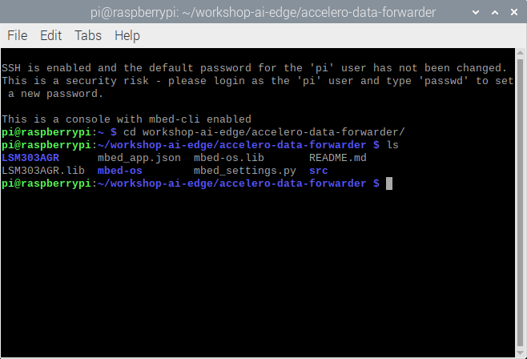

# Inspecting the Firmware

In this project we will let the Sensortile output three-axis accelerometer data (x, y, z) at a rate of 100 Hz. The values will be available on the (virtual) serial port which is provided via the USB connector on the device. The Sensortile contains an STM32L476JGY microcontroller. This microcontroller is compatible with the STM32L476RG microcontroller which is supported by the ARM mbed framework.

## Mbed prerequisites

To be able to compile an mbed project, we can make use of several tools such as the [Mbed Online Compiler](https://os.mbed.com/ide/), the [Mbed Studio](https://os.mbed.com/studio/) or [Mbed CLI1](https://os.mbed.com/docs/mbed-os/v6.15/build-tools/mbed-cli-1.html). The latter will be using throughout this workshop because of it's easy to use command line interface and use on Linux-based systems. Mbed CLI1 and its dependencies have already been installed by the installation script and is available by double-clicking the terminal icon on the desktop name **mbed-cli**.

 

By double-clicking the icon, a terminal is opened running in a virtual environment with mbed-cli enabled together with its dependencies. This is required to not interfere with the installed packages for running the Jupyter Notebook from Part 1 of this workshop.

## Mbed project files

The required mbed project files to generate the accelerometer data have been automatically cloned from [it's repository](https://github.com/vives-ai-edge/accelero-data-forwarder) by the installation script. Its location is: `~/workshop-ai-edge/accelero-data-forwarder`. One can go manullay into the folder by using the File Manager, or by changing the directory in the terminal to the one of the project:

```bash
pi@raspberrypi:~ $ cd workshop-ai-edge/accelero-data-forwarder
```

**Note: Please run this command and the following inside the mbed-cli terminal and not in the normal terminal application of RaspiOS. In case you are using the normal terminal, activate the virtual environment by sending the following command:**

```bash
source ~/.venv/mbed/bin/activate
```

This will activate the mbed-cli virtual environment and `(mbed)` should now stand in front of you commandline.

When typing in `ls` one can see which files are located in the folder of the accelero-data-forwarder project. Your terminal should show something like this:



The folder contains several folders (in **bold**) and files. A short description of each file or folder is given:

- **LSM303AGR**: Folder with the accelerometer library files.
- mbed_app.json: Mbed configuration file.
- mbed-os.lib: Library file for Mbed OS.
- README.md: Markdown file with the explanation of the repository on Github.
- LSM303AGR.lib: Library file for the accelerometer sensor.
- **mbed-os**: Folder with the Mbed OS libarary files.
- mbed_settings.py: Python file with Mbed OS settings.
- **src**: Folder with the source files (main.cpp)

We are now going to investigate the firmware which will be compiled and put on to the Sensortile Microcontroller. The main code is located in the main.cpp file in the **src**-folder. We can open the file with Geany which is pre-installed on RaspiOS:

```bash
pi@raspberrypi:~/workshop-ai-edge/accelero-data-forwarder $ geany src/main.cpp
```

## The firmware

The code can be split up into five parts:

- Library imports
- Peripheral definitions
- Functions
- Initialisation or setup code
- Loop code

### Library imports

