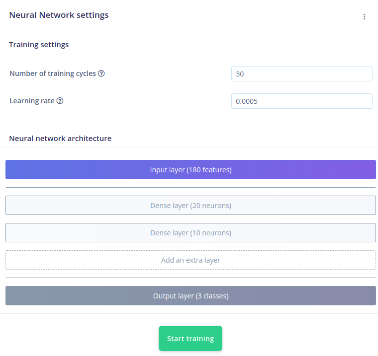
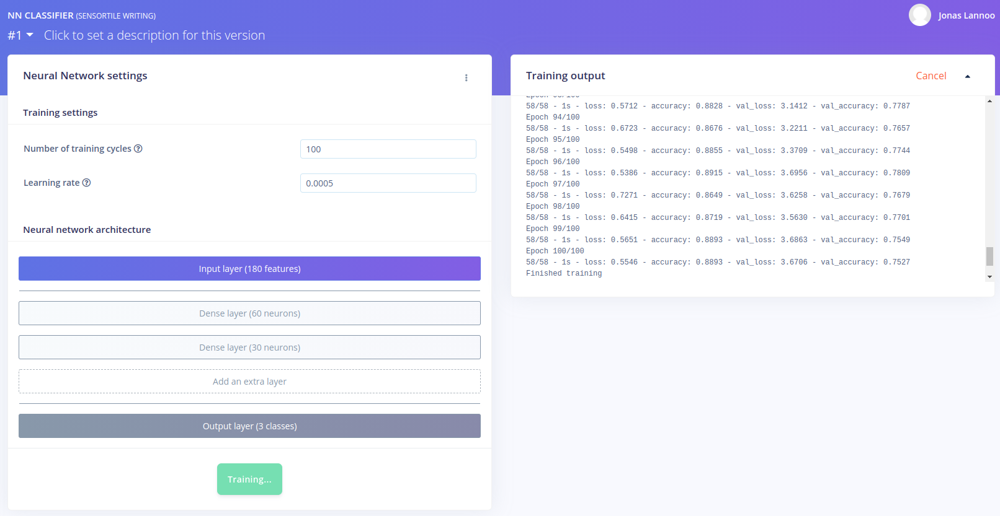
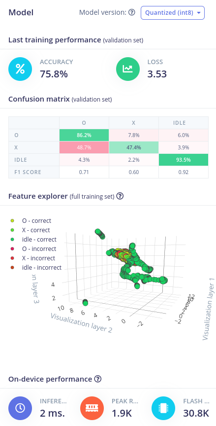

# NN Training

The learning block of the impulse design was configured as a Keras Classification block. In this block we have to configure the settings of a Neural Network (NN) and train the NN.

## NN settings

The neural network has several training settings and an architecture that can be configured. The training settings consist of a number of training cycles and a learning rate. The **Number of training cycles** means how much **epochs** a neural network has to be trained. An **epoch** is an instant in time chosen when something new starts, in the case of training a neural network, an epoch denotes the start of a new training cycle. The **Learning rate** will configure how fast the neural network learns. The learning rate is a factor that decides how big or small the update of a node its weight will change. If the network overfits quickly, then lower the learning rate. The default number of training cycles configured in Edge Impulse is 30, and the default learning rate is 0.0005.

Because we have a quite small data set we are going to change the number of training cycles to 100. The learning rate we will leave as is.

:::tip Hyperparameters

The number of epochs and learning rate are a part of the hyperparameters of a neural network. You don't have to follow the numbers of this workshop and can change them to achieve better (or worse) training results.

:::

## NN architecture

Next in the NN settings is the NN architecture where we configure the layout of the AI model. As in the introduction and "hello world"-example, we have to configure inputs, outputs and some layers in between. In this case our number of inputs is configured by the feature generation step. We can see that the number of inputs is 180 features. How do we get this number?

- One window was configured as 600 ms
- Our sampling frequency is 100 Hz
- This would mean 60 samples per window
- We have three axes with inputs (accX, accY and accZ)
- We are performing no special feature extraction, the signal processing block its output is the raw data
- 60 samples x 3 axes = 180 features

The number of inputs is also fixed and are the labels we configured during data acquisition.

The layers in between are pre-configured and the default is two dense layers with 20 and 10 neurons (or nodes) respectively.

## NN training

## NN results

