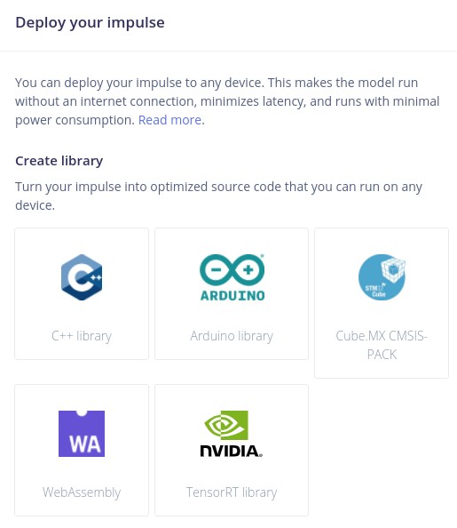
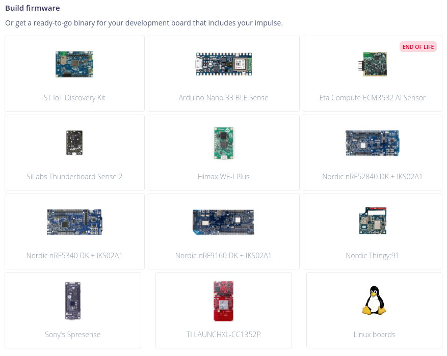
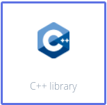
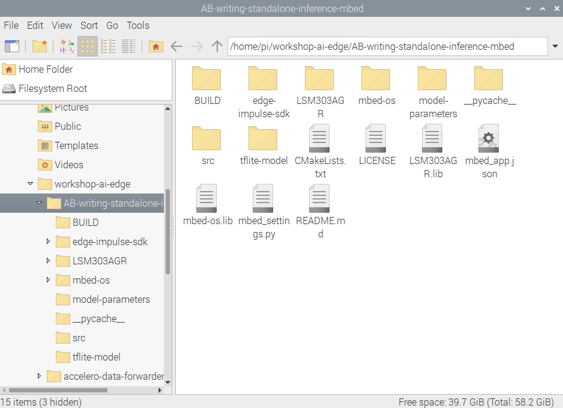

# Deployment

In the Edge Impulse menu, go to the *Deployment*-tab.

Instead of running the neural network in Edge Impulse with the *Live Classification* method and the *edge-impulse-data-forwarder*, we are now going to run the model directly on the Sensortile microcontroller. Therefore we need to extract the model from Edge Impulse by using the deployment functionality.

Edge Impulse gives us several methods to deploy the impulse or the neural network to your device of choice. Two main methods are available:

1. Create a library which we can use in our development tool of choice.
2. Build the firmware directly for a specific device.

Under *create library* we can see several commonly used development tools and their corresponding library exports, such as Arduino, Cube.MX from STM, TensorRT from Nivida etc.

Under *build firmware* we can see several hardware edge-devices which are directly supported by the Edge Impulse framework. For example the ST, Arduino and Nordic development boards.

As our device is not listed in the device list, we are going to download the *optimized* source code *create a library*. Because we are using the mbed tools to compile and deploy our code to the Sensortile, we are going to specify the *C++ library* export. In this way we can use the exported files as normal C++ libraries in our mbed project.

Selecting the library type does not give us a library yet. Edge Impulse gives us the choice to use their optimisation tool "EON" to improve the size of the model even more.

:::tip Edge Impulse EON Compiler

The EON compiler is not a completely new runtime, it still uses Tensorflow Lite for Microcontrollers under the hood and is also the reason why the latency numbers will be exactly the same with and without enabling the EON compiler. Tensorflow Lite for Microcontrollers has a generic model interpreter and interpretes and runs the model at runtime. EON will compile the neural network to C++ source code so it can be directly run on the microcontroller without first interpreting it. By compiling the neural network to source code the interpreter is not necessary, more data can be placed in ROM memory and the linker will know exactly which operations are being used. In this way a lot more code can be eliminated and less resources are used.

:::

As can be seen in the figure below we now have four options to export the library:

- Disabled EON compiler & Unoptimized (float32) model
- Disabled EON compiler & Quantised (int8) model
- Enabled EON compiler & Unoptimized (float32) model
- Enabled EON compiler & Quantised (int8) model

To see the performance difference we can press the **Analyze optimizations** button. The result will show the performance difference in RAM, latency and the confusion matrix.

